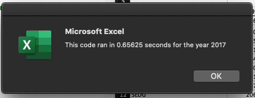
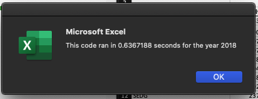

# Stock-Analysis
Module 2: VBA of Wall Street

Submitted by Isaac D. Tucker-Rasbury

## Overview of Project
The subroutine we created for our client, Steve, analyzes the annual market performance of a list of pre-provided stocks using observations of said stocks from January 1st to December 31st for the year of data provided. The subroutine compiles the daily trading volume for each stock and, also, identifies the return on each investment for the year into a table for a highlevel summary of the list of stocks' performance. Steve intends to use the subroutine to help his parents identify their best options for stocks; his parents are interested in stocks in the energy sector and have asked him to help. To make reading the stock performance analysis easy for Steve's family, we have added conditional formatting in the subroutine to highlight important information for them to consider while making their investment decisions.

## Results
In summary, we found that the 12 stocks we analyzed performed significantly and consistently better in 2017 than in 2018. 

The 12 stocks we used the subroutine to analyze over the two years for which we had data are as follows: 

- AY
- CSIQ
- DQ
- ENPH
- FSLR
- HASI
- JKS
- RUN
- SEDG
- SPWR
- TERP
- VSLR

The key takeaways from the analysis produced by the subroutine are in the subsections below.

### Year over Year Stock Performance Analysis

Of the 12 stocks, in 2017 11 stocks had positive returns and one stock had negative returns. The average return was 67.3%, the max was 199.4%, and the minimum was -7.2% The execution time for the subroutine running this year's analysis is below the table.

##### All Stocks 2017 Output

%20Ouput.png)

##### Refactored 2017 Output Execution Time

In 2018, returns were worse than in 2017 and significantly so. Two stocks had positive returns and 10 had negative returns. The average return was -8.5%, the
max was 84%, and the minimum was -62.6%. The execution time for the subroutine running this year's analysis is below the table.

##### All Stocks 2018 Output

%20Output.png)

##### Refactored 2018 Output Execution Time

## Summary

### Refactoring in General

To discuss "refactoring" code, let us begin with a shared definition provided in the Module 2 Challenge - Background section.

> "Refactoring" is a key part of the coding process. When refactoring code, you aren’t adding new functionality; you just want to make the code more efficient—by taking fewer steps, using less memory, or improving the logic of the code to make it easier for future users to read. Refactoring is common on the job because first attempts at code won’t always be the best way to accomplish a task. Sometimes, refactoring someone else’s code will be your entry point to working with the existing code at a job.

_citation: Module 2 Challenge - Background_

Given that good code reuses frequently used patterns, refactoring code, particularly making it more efficient, has multiplicative beneficial impact. When one section of code has been made more effient, similar code may be able to be updated as well. Second to that, refactoring code gives an individual the chance to standardize code as they go along. This can help people new to the code navigate the code more easily.Unfortunately, these advantages can also be disadvantages when applied indiscriminately. If code is overstandardized then an agreed upon fix that appears to be over specific may be erased and its benefits lost. Second to that, bad habits in standardized code may be taught to coders coming after the original team since they are using the original code as a guide. Finally, refactoring code means using a previously used framework which means correcting or allowing old errors of that framework to persist. 

### Refactoring in this Module

In this module, I first attempted to reuse the original tickers code structure to create the code for increasing the volume for the ticker. I was attempting to standardize the code, but actually found that was an impediment to me coding a useful solution. By extention though, the available code made writing the if statements more easy because I could use them as a reference.
